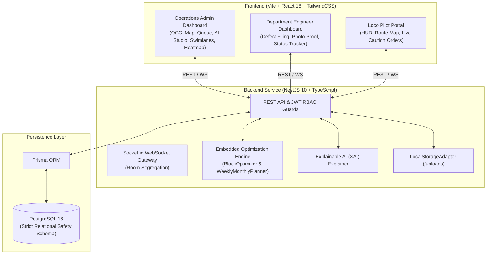

# RailSync AI — Automatic Block Planning System
### AI-Powered Maintenance Scheduling & Asset Availability Maximizer for Indian Railways

> **Corridor Prototype**: South Central & East Coast Mainline — **Secunderabad Jn (`SC`) ↔ Visakhapatnam Jn (`VSKP`)** (699 KM, 10 Stations, 9 Track Segments).

---

## 📌 Project Overview

**RailSync AI** is a real-time, AI-driven railway maintenance block planning and conflict-resolution system designed to maximize railway asset availability while safeguarding passenger and freight train punctuality.

Traditional block planning in Indian Railways is manually coordinated across disparate departments (Civil Engineering/P-Way, Traction Distribution/OHE 25kV, and Signal & Telecom), leading to delayed approvals, corridor bottlenecks, and train detentions. **RailSync AI** solves this through:

1. **Multi-Factor Priority Scoring Formulation**: Dynamically weighs defect severity, urgency, safety risk, and single-line bottlenecks.
2. **Automated Conflict Detection & Shadow Window Generation**: Detects overlapping crew rosters, corridor possessions, and timetable collisions.
3. **Explainable AI (XAI)**: Provides human-readable mathematical justification and safety code compliance checks for Chief Controllers.
4. **Real-Time Cross-Role Collaboration**: Instant bi-directional communication across Operations Control, Department Maintenance Gangs, and Chief Loco Pilots via WebSocket rooms.

---

## 🏛️ System Architecture



---

## 🔑 Pre-Seeded Demo Accounts & Credentials

The system comes pre-seeded with real-world Indian Railways roles on the Secunderabad–Visakhapatnam corridor:

| Role | Employee ID | Email | Password | Assigned Corridor / Train |
|---|---|---|---|---|
| **Chief Controller (Admin)** | `EMP-ADM-001` | `admin@railsync.ir` | `Admin@123` | Operations Control Centre (Corridor-wide) |
| **Sr. Section Engineer (Civil)** | `EMP-ENG-101` | `engg@railsync.ir` | `Password@123` | Engineering Department (P-Way) |
| **OHE Section Engineer (Electrical)** | `EMP-TD-201` | `td@railsync.ir` | `Password@123` | Traction Distribution (25kV OHE) |
| **Signal Inspector (S&T)** | `EMP-SNT-301` | `sandt@railsync.ir` | `Password@123` | Signal & Telecommunication |
| **Chief Loco Pilot (Driver)** | `EMP-PLT-501` | `pilot@railsync.ir` | `Password@123` | Train 12728 (Godavari Superfast Express) |

---

## 🚀 Quick Start Guide

### Option 1: Run with Docker Compose (Single Command)

Prerequisites: [Docker & Docker Desktop](https://www.docker.com/)

```bash
# Clone and enter directory
cd reddy513

# Start PostgreSQL, Backend, and Frontend containers
docker-compose up --build
```

- **Frontend Portal**: [http://localhost:5173](http://localhost:5173)
- **Backend API**: [http://localhost:4000](http://localhost:4000)
- **PostgreSQL Database**: `localhost:5432`

---

### Option 2: Run Locally for Development

Prerequisites: Node.js 18+, PostgreSQL (running on port `5433` or configured in `backend/.env`)

#### 1. Backend Setup:
```bash
cd backend
npm install
npx prisma generate
npx prisma db push
npm run prisma:seed
npm run start:dev
```
*Backend runs at `http://localhost:4000`*

#### 2. Frontend Setup:
```bash
cd frontend
npm install
npm run dev
```
*Frontend runs at `http://localhost:5173`*

---

## 🧠 Core Optimization & AI Features

### 1. Multi-Factor Priority Score Formulation
Implemented in [`backend/src/engine/blockOptimizer.ts`](file:///c:/Users/omkar/OneDrive/Documents/reddy513/backend/src/engine/blockOptimizer.ts):

$$\text{Priority} = 0.35 \times \text{Severity} + 0.25 \times \text{Urgency} + 0.20 \times \text{SafetyRisk} + 0.20 \times \text{AssetBottleneck}$$

- **Severity ($w_1 = 0.35$)**: Critical (100), High (75), Medium (50), Low (25).
- **Urgency ($w_2 = 0.25$)**: Calculated as a function of elapsed defect time and estimated train detention minutes.
- **Safety Risk ($w_3 = 0.20$)**: S&T (95, interlocking collision risk), TD (90, 25kV OHE hazard), Engineering (100 for derailment risk, 80 standard).
- **Asset Bottleneck ($w_4 = 0.20$)**: Single-line sections (Duvvada ↔ Visakhapatnam) score 95 due to network throughput collapse vs 65 for double-line track.

### 2. Candidate Window Generation
The engine evaluates 3 candidate windows for each maintenance defect:
- **Candidate 1: Immediate Shadow Block Window** (Integrated joint block utilizing off-peak traffic intervals).
- **Candidate 2: Midday Traffic Lull Window** (Exploits passenger schedule gaps between 11:30 and 13:45).
- **Candidate 3: Night Low-Density Window** (01:00 to 04:00 off-peak heavy maintenance).

### 3. Explainable AI (XAI) Module
Implemented in [`backend/src/engine/xaiExplainer.ts`](file:///c:/Users/omkar/OneDrive/Documents/reddy513/backend/src/engine/xaiExplainer.ts):
- Transparently decomposes the mathematical score for human safety audits.
- Verifies hard constraints: Crew Overlap Conflict Free, Corridor Exclusivity, Timetable Integrity.
- Generates Joint Departmental Coordination Directives and Safety Compliance Mandates.

---

## 🧪 Testing & Verification

Run the automated test suite covering optimization formulas, conflict detection, and role-based security:

```bash
# Run backend Jest unit tests
npm --prefix backend run test

# Run frontend production build validation
npm --prefix frontend run build
```

---

## 📁 Repository Structure

```
reddy513/
├── backend/                      # NestJS 10 Service
│   ├── prisma/                   # Schema, relations & corridor seed script
│   ├── src/
│   │   ├── engine/               # Optimizer, XAI & Planner engines + specs
│   │   ├── modules/
│   │   │   ├── auth/             # JWT, Bcrypt, Passport & RolesGuard
│   │   │   ├── requests/         # Multer storage, workflow & status updates
│   │   │   ├── optimizer/        # AI Block recommendation endpoints
│   │   │   ├── segments/         # Track segments & station telemetry
│   │   │   ├── trains/           # Train scheduling & pilot tracking
│   │   │   ├── notifications/    # Socket.io gateway & persistent alerts
│   │   │   └── audit/            # Immutable operations audit logs
│   ├── Dockerfile
│   └── package.json
├── frontend/                     # React 18 + Vite + TailwindCSS
│   ├── src/
│   │   ├── api/                  # Axios typed API client
│   │   ├── components/           # CorridorTrackMap, ProtectedRoute, Layout
│   │   ├── pages/
│   │   │   ├── LoginPage.tsx     # Role-based login
│   │   │   ├── RegisterPage.tsx  # Employee registration
│   │   │   ├── RoleSelectPage.tsx# Interactive portal selector
│   │   │   └── dashboards/
│   │   │       ├── AdminDashboard.tsx       # OCC, Map, Queue, Schedule, Heatmap
│   │   │       ├── AdminOptimizerStudio.tsx # Dedicated XAI Optimizer Workbench
│   │   │       ├── DepartmentDashboard.tsx  # Defect filing & status tracking
│   │   │       └── UserDashboard.tsx        # Loco Pilot HUD & Route Map
│   ├── nginx.conf
│   ├── Dockerfile
│   └── package.json
├── docker-compose.yml            # Multi-container production deployment
├── DECISIONS.md                  # Architectural decisions & design rationale
└── README.md                     # Comprehensive project documentation
```
